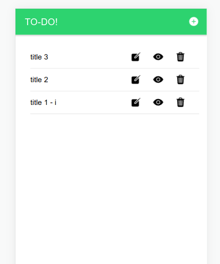
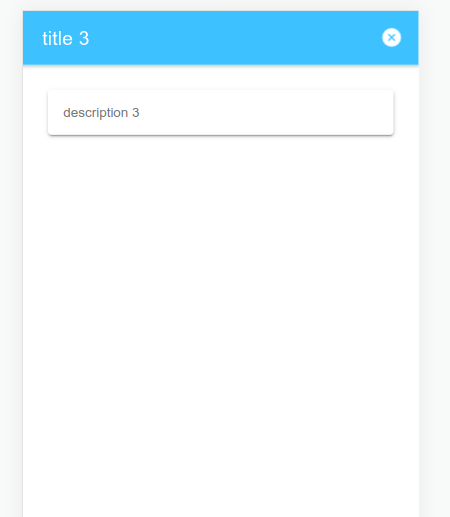
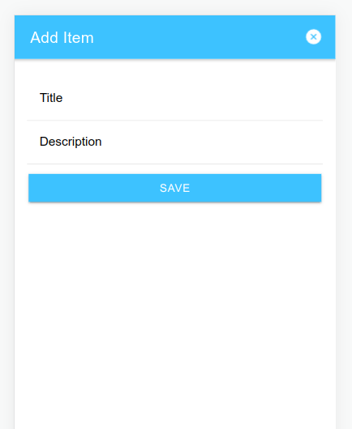
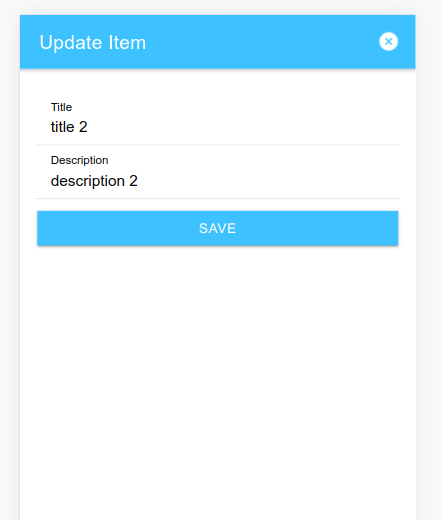

# Primeira atividade

Para a primeira ativade foi solicitado continuar a implementação do aplicativo TODO, o qual foi iniciado durante as aulas da disciplina. Durante as aulas foi implementada as funções para criar e visualizar tarefas que são listadas na tela principal, e para esta atividade foi solicitado implementar mais uma função, editar ou excluir tarefas.

## Resolução

Ainda durante a implementação em aula, algumas adaptações foram feitas a fim de utilizar a versão mais atual v.6 do Ionic, bem como para esta atividade foi utilizado a framework React, enquanto nas instruções foi utilizado o Angular.

A IDE utilizada foi o VS Code com o plugin DevContainer para encapsular as dependências do aplicativo em um container. Assim, a imagem docker utilizada foi a `mcr.microsoft.com/devcontainers/typescript-node:0-18` adicionando à ela a característica `ghcr.io/devcontainers-contrib/features/ionic-cli:2`. Os arquivos de configuração do ambiente de desenvolvimento foi salvo na pasta `.devcontainer` na raiz do repositório.

Basicamente para resolução da atividade, além da estrutura gerada pela ferramenta de criação do Ionic, foram criados os arquivos abaixo relacionados, bem como foi editado o arquivo `App.tsx` afim de adicionar as rotas para as telas criadas.

./src                   \
│                       \
├── @types              \
│   ├── extending.d.ts  \
│   └── todo.d.ts       \
├── context             \
│   └── TodoContext.tsx \
├── pages               \
│   ├── Home.tsx        \
│   ├── ItemDetail.tsx  \
│   └── ItemForm.tsx    \
└── App.tsx             \

Os arquivos no diretório @types definem os tipos (typescripts) utilizados, sendo os principais a interface para o objeto TODO e o tipo TodoContextType que impõe a implementação, por abstração, de um parametro para receber um array de TODO e três funções saveTodo, updateTodo e deleteTodo.

Pelo arquivo `TodoContext.tsx`, utilizando a API Context do react, foi implementado um ponto central para gerir o estado da lista de todos.

Os arquivos `Home.tsx`, `ItemDetail.tsx` e `ItemForm.tsx` definem as telas da aplicação, sendo que a tela `ItemForm` é utilizada tanto para adicionar um novo TODO quanto para editar os existentes.

## Imagens da aplicação no browser

### Tela principal

Responável por listar os todos.

### Tela detalhes

Responsável por mostrar um todo adicionado em detalhes.

### Tela de edição

Esta tela contém formulário para criar novo todo ou editar todo existente. Ao apresentar a tela, é verificado se foi passado como parametro dados de um todo existente, caso os parametros existam é então apresentado o formulário para editar o todo fornecido, caso não seja passado um todo então é apresentado um formulário para salvar um novo todo.

 