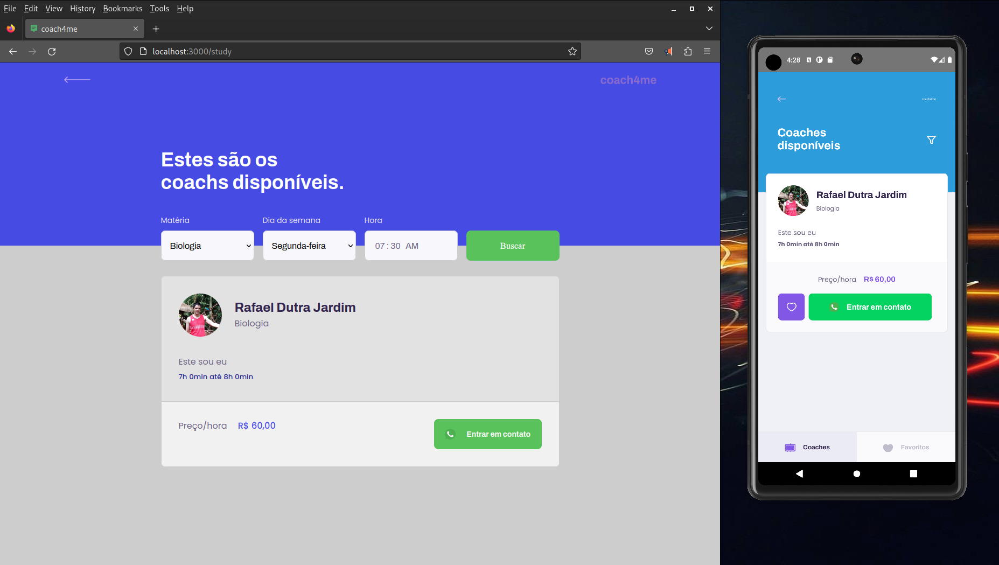

# Segunda atividade

Para a segunda atividade foi solicitado continuar a implementação do aplicativo Coach4Me (web/mobile/server). Durante as aulas foi implementado um servidor express para servir como interface API Rest para um gerenciador de dados SQLite; um aplicativo web para coaches se cadastrarem informando sua disponibilidade e a funcionalidade para buscar coaches disponiveis conforme filtro de dia, horário e matéria; e um aplicativo para smartphone para buscar coaches disponíveis.

A seguinte atividade foi solicitada:

> No cadastro de coaches é permitido cadastrar diversos horários de aula disponíveis diferentes.
> Na listagem de coaches, se você olhar no layout, perceberá que não são exibidos os horários disponíveis dos coaches logo abaixo da bio dele. Seu trabalho é implementar essa funcionalidade.
> Para isso, você apenas precisa trazer junto aos dados do coach as informações de seus dias disponíveis fazendo um join com a tabela class_schedule para retornar esses dados junto com a listagem.

## Resolução

Para trazer os dados do SQLite utilizando o Knex foi implementado o seguinte trecho de código:

```js
const classes = await db('classes')
  .where('classes.subject', '=', subject)
  .where('class_schedule.week_day', '=', week_day)
  .where('class_schedule.from', '<=', timeInMinutes)
  .where('class_schedule.to', '>', timeInMinutes)
  .join('coaches', 'classes.coach_id', '=', 'coaches.id')
  .join('class_schedule', 'classes.id', '=', 'class_schedule.class_id')
  .select(['classes.*', 'coaches.*', 'class_schedule.*'])
```

Dessa forma o endpoint GET /classes passou a retornar o resultado no formato abaixo:

```json
[
    {
        "id": 10,
        "subject": "Biologia",
        "cost": "60",
        "coach_id": 4,
        "name": "Rafael Dutra Jardim",
        "avatar": "https://avatars.githubusercontent.com/u/38335241?v=4",
        "whatsapp": "31920070000",
        "bio": "Este sou eu",
        "week_day": "1",
        "from": "420",
        "to": "480",
        "class_id": 4
    }
]
```

Na interface web e mobile, o resultado ficou conforme a imagem abaixo:

